# Développement d’une application micro-services sécurisee: Spring Boot – React – Keycloak

## Diagramme d’architecture globale

L’architecture est orchestree par Docker Compose pour lancer tous les services (frontend, gateway, microservices, bases, Keycloak, SonarQube). Le client web se connecte au frontend React, qui appelle l’API Gateway. Le gateway route vers les microservices Produit et Commande, securises par Keycloak via JWT. Chaque microservice persiste ses donnees dans sa base PostgreSQL. SonarQube analyse le code du projet pour la qualite et la securite.

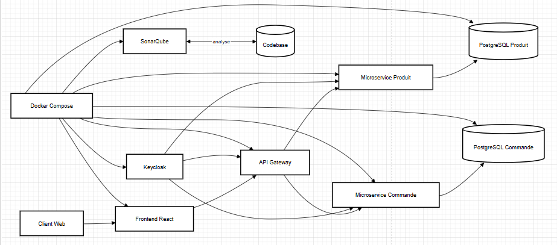

## Diagramme de séquence du processus de commande

Le client construit un panier dans le frontend, puis envoie une creation de commande au gateway avec un JWT. Le microservice Commande consulte le microservice Produit pour verifier le stock. Si le stock est suffisant, la commande et ses items sont enregistres, sinon une erreur est retournee au client.


## developement du microservice produit

Ce microservice gere le catalogue des produits (CRUD), expose une API REST documentee par Swagger et persiste les donnees dans PostgreSQL via Spring Boot.
Port: `8081`.

Ordre d'implementation (extraits):

Entite:
```java
@Entity
@Table(name = "products")
public class Product {
    @Id
    @GeneratedValue(strategy = GenerationType.IDENTITY)
    private Long id;

    @Column(nullable = false)
    private String name;
}
```

Repository:
```java
public interface ProductRepository extends JpaRepository<Product, Long> {
}
```

Mapper:
```java
public Product toEntity(ProductCreateRequest request) {
    return new Product(null, request.getName(), request.getDescription(),
            request.getPrice(), request.getQuantity());
}
```

Service:
```java
Product product = productRepository.findById(id)
        .orElseThrow(() -> new ResponseStatusException(HttpStatus.NOT_FOUND, "Product not found"));
productMapper.updateEntity(request, product);
```

Controller:
```java
@PostMapping
public ResponseEntity<ProductResponse> create(@RequestBody ProductCreateRequest request) {
    ProductResponse response = productService.create(request);
    URI location = ServletUriComponentsBuilder.fromCurrentRequest()
            .path("/{id}")
            .buildAndExpand(response.getId())
            .toUri();
    return ResponseEntity.created(location).body(response);
}
```

Images (PostgreSQL et Swagger):

Capture de la table produits dans PostgreSQL.

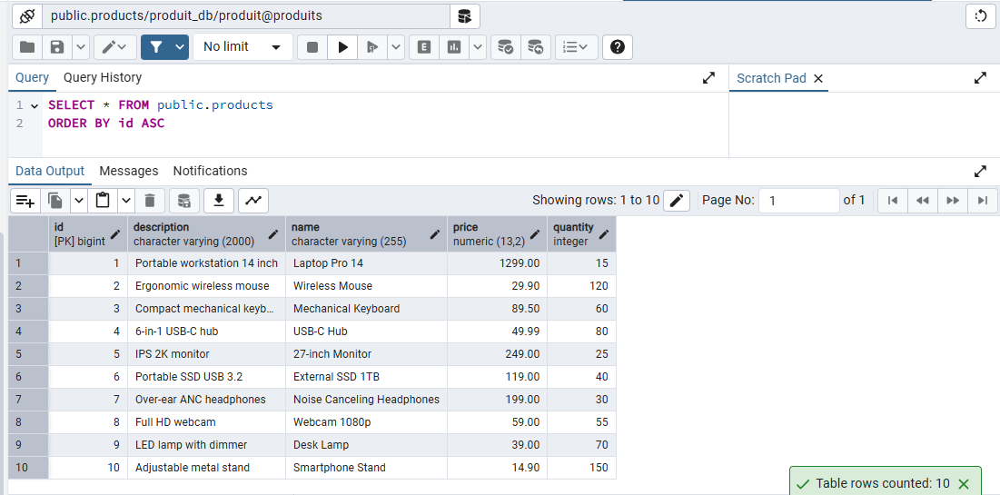

Capture de l'interface Swagger affichant toutes les methodes du controleur produit.

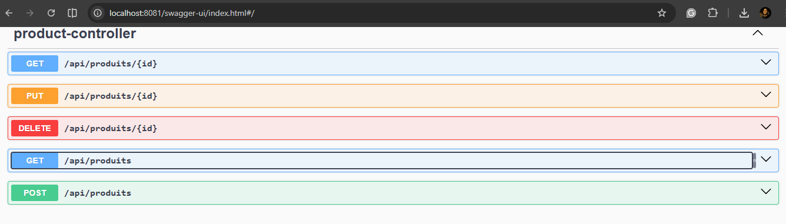

Capture d'un test d'ajout de produit via Swagger.

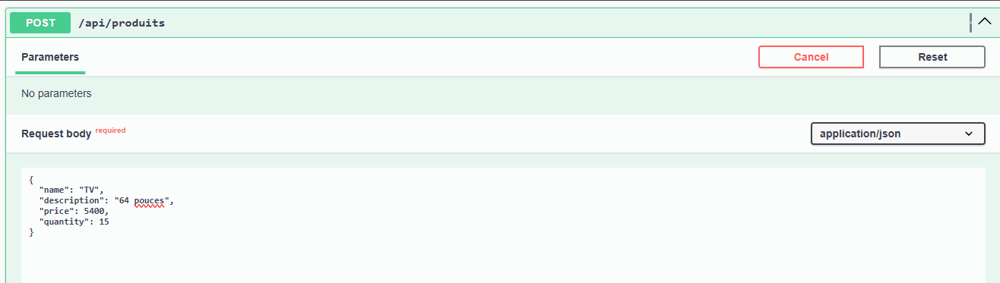

Capture du test de recuperation des produits.

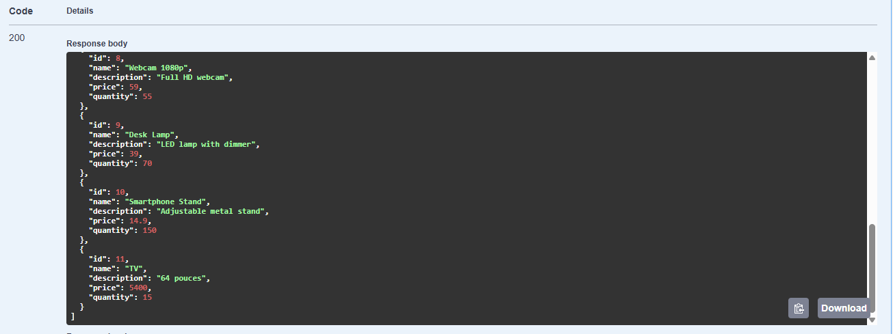

## developpement du microservice commande

Port: `8082`.

Ordre d'implementation (extraits):

Entites (commande + items):
```java
@Entity
@Table(name = "commandes")
public class Commande {
    @OneToMany(mappedBy = "commande", cascade = CascadeType.ALL, orphanRemoval = true)
    private List<CommandeItem> items = new ArrayList<>();
}

@ManyToOne(fetch = FetchType.LAZY)
@JoinColumn(name = "commande_id", nullable = false)
private Commande commande;
```

Repository:
```java
List<Commande> findByClientId(String clientId);
```

Mapper:
```java
BigDecimal lineTotal = item.getPrice()
        .multiply(BigDecimal.valueOf(item.getQuantity()));
```

Service:
```java
ProductSnapshot product = produitCatalogService.getProduct(itemRequest.getProductId(), authorization);
int available = product.getQuantity() == null ? 0 : product.getQuantity();
if (available < itemRequest.getQuantity()) {
    throw new ResponseStatusException(
            HttpStatus.BAD_REQUEST,
            "Insufficient stock for product " + product.getId() + ". Available: " + available
    );
}
```

Controller:
```java
if (jwt != null && !hasRole(jwt, "ADMIN")) {
    String username = jwt.getClaimAsString("preferred_username");
    String principalId = username != null ? username : jwt.getSubject();
    if (!clientId.equals(principalId)) {
        throw new ResponseStatusException(HttpStatus.FORBIDDEN, "Cannot access other client orders");
    }
}
```

Capture des tables du schema commande dans PostgreSQL.

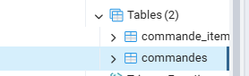

Capture de la table commandes avec les enregistrements.

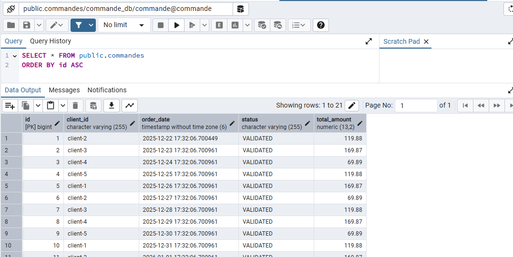

Capture de la table commande_items.

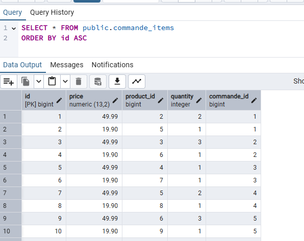

Capture du test d'ajout d'une commande via Swagger.

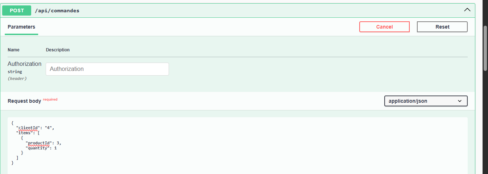

Capture du test de consultation de toutes les commandes.

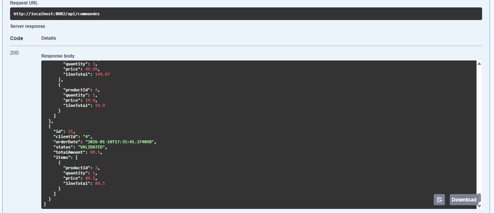

## developpement du microservice gateway

Le gateway centralise les routes, la securite et la propagation du JWT vers les microservices.

Extrait de routage dynamique (configurable via variables d'environnement):
```java
@Bean
public RouteLocator gatewayRoutes(
        RouteLocatorBuilder builder,
        @Value("${services.produit-url:http://localhost:8081}") String produitUrl,
        @Value("${services.commande-url:http://localhost:8082}") String commandeUrl
) {
    return builder.routes()
            .route("produit-service", r -> r.path("/api/produits/**").uri(produitUrl))
            .route("commande-service", r -> r.path("/api/commandes/**").uri(commandeUrl))
            .route("catalog-images", r -> r.path("/catalog/**").uri(produitUrl))
            .build();
}
```

Regles de securite (extrait) appliquees au gateway:
```java
authorizeExchange(exchanges -> exchanges
        .pathMatchers(HttpMethod.POST, "/api/produits/**").hasRole("ADMIN")
        .pathMatchers(HttpMethod.GET, "/api/produits/**").hasAnyRole("ADMIN", "CLIENT")
        .pathMatchers(HttpMethod.POST, "/api/commandes/**").hasRole("CLIENT")
        .pathMatchers(HttpMethod.GET, "/api/commandes").hasRole("ADMIN")
        .pathMatchers(HttpMethod.GET, "/catalog/**").permitAll()
        .anyExchange().authenticated()
)
```

## integration de keycloak

Configuration manuelle du realm `gestion-produits_commandes`, des roles (`ADMIN`, `CLIENT`),
des users (admin1/client1) et des clients (frontend, gateway, produit, commande).

Extraction des roles depuis le JWT (extrait):
```java
Object realmAccess = jwt.getClaim("realm_access");
if (realmAccess instanceof Map<?, ?> realmAccessMap) {
    Object roles = realmAccessMap.get("roles");
    if (roles instanceof Collection<?> roleList) {
        roleList.forEach(role -> roleNames.add(role.toString()));
    }
}
```

Capture de l'interface Keycloak (login):

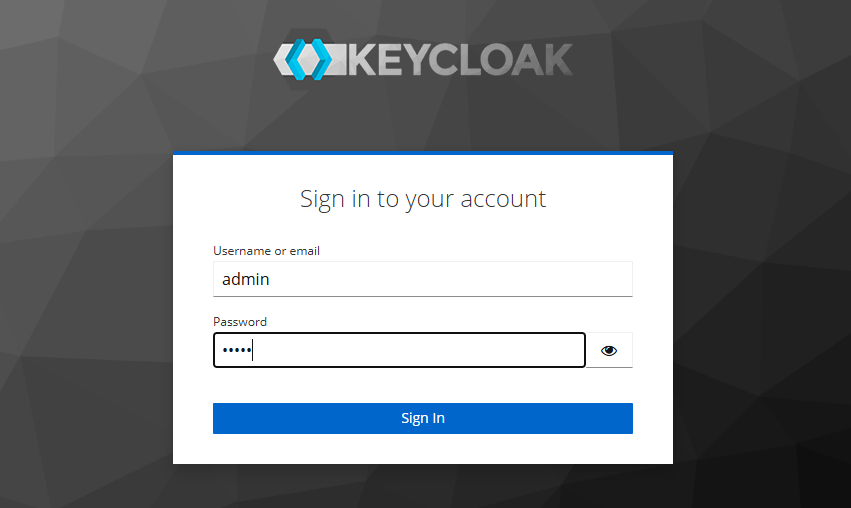

## developpement du frontend

Frontend React avec authentification Keycloak, dashboard, pages produits et commandes.

Ordre d'implementation (extraits):

Auth (Keycloak + roles):
```jsx
const keycloakRef = useRef(buildKeycloak())
const [state, setState] = useState({ initialized: false, authenticated: false, roles: [] })

const getValidToken = async () => {
  const keycloak = keycloakRef.current
  if (!keycloak.authenticated) return null
  await keycloak.updateToken(30)
  return keycloak.token
}

const hasRole = (role) => state.roles.includes(role)
```

Client API (JWT automatiquement ajoute):
```js
const headers = new Headers(options.headers || {})
if (token) {
  headers.set('Authorization', `Bearer ${token}`)
}
return fetch(`${API_BASE_URL}${path}`, { ...options, headers })
```

Composant Layout (navigation + logout):
```jsx
<NavLink to="/products" className="nav-link">Products</NavLink>
<NavLink to="/commands" className="nav-link">Commands</NavLink>
<button className="btn secondary" type="button" onClick={logout}>Logout</button>
```

Page Produits (vue admin/client + images):
```jsx
const isAdmin = hasRole('ADMIN')

 {
    event.currentTarget.onerror = null
    event.currentTarget.src = productImages[index % productImages.length]
  }}
  alt={product.name}
/>
```

Page Commandes (admin = toutes, client = propres commandes):
```jsx
const isAdmin = hasRole('ADMIN')
const data = isAdmin
  ? await api.listCommandes(token)
  : await api.listCommandesByClient(username, token)
```

Nature d'acces:
- ADMIN: gestion des produits (CRUD) et consultation de toutes les commandes.
- CLIENT: consultation du catalogue, creation de commande et historique personnel.

Interfaces (admin/client) et visibilite:

L'ecran de connexion Keycloak sert aux deux profils (admin et client).

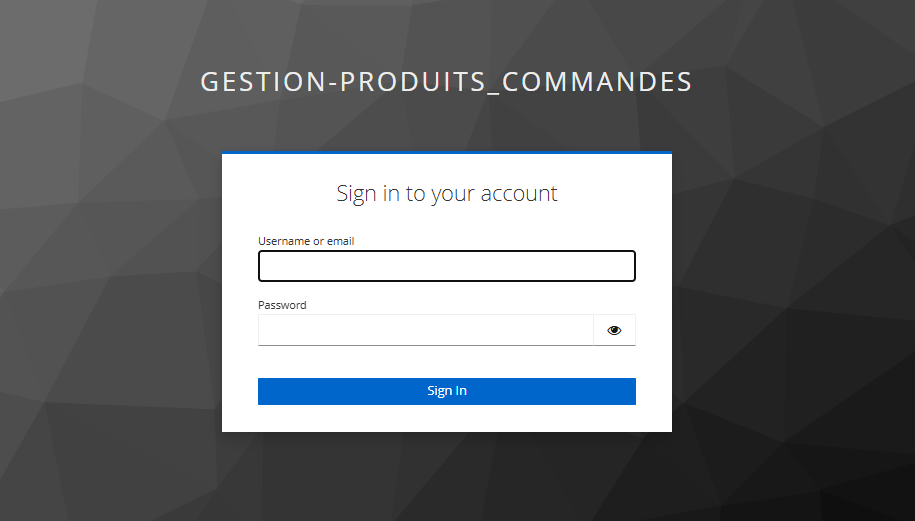

Admin: tableau de bord avec indicateurs globaux (produits, commandes, stock, revenu).

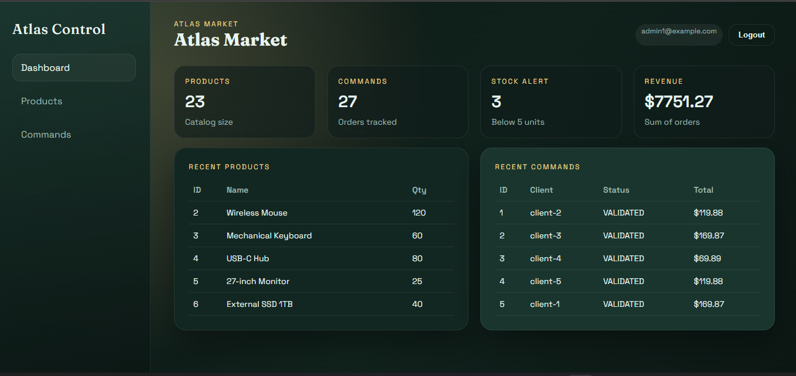

Admin: liste des produits avec actions (edit/delete) et gestion du catalogue.

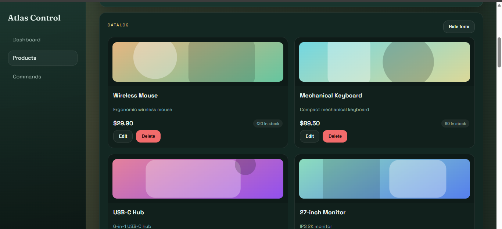

Admin: formulaire d'ajout de produit (nom, description, prix, quantite, image).

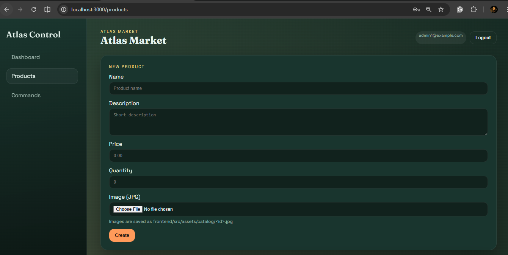

Admin: liste des commandes avec details des items.

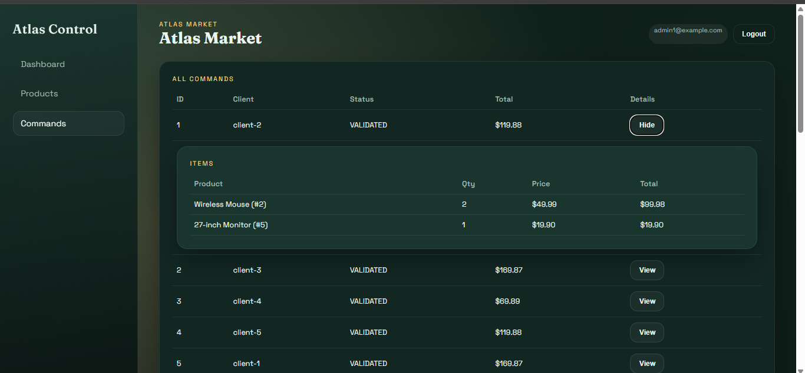

Client: tableau de bord avec ses propres statistiques.

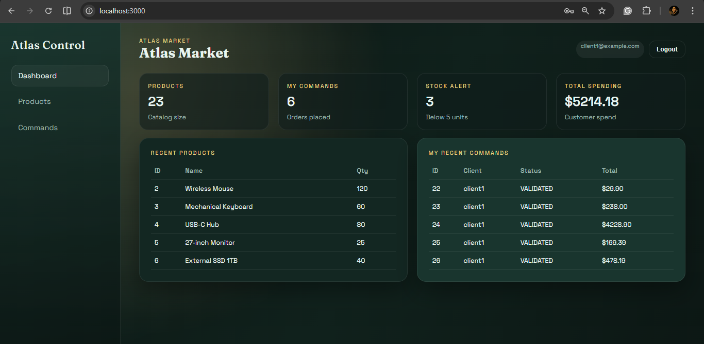

Client: catalogue produits et panier pour creer une commande.

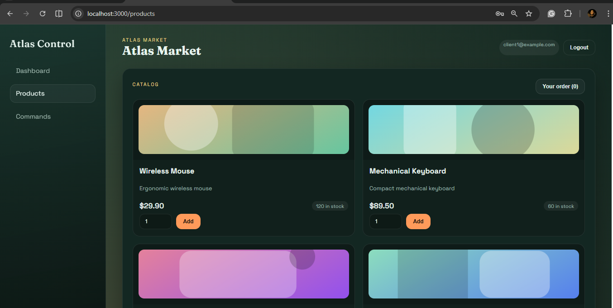

Client: detail de la commande en cours (items, quantites, total).

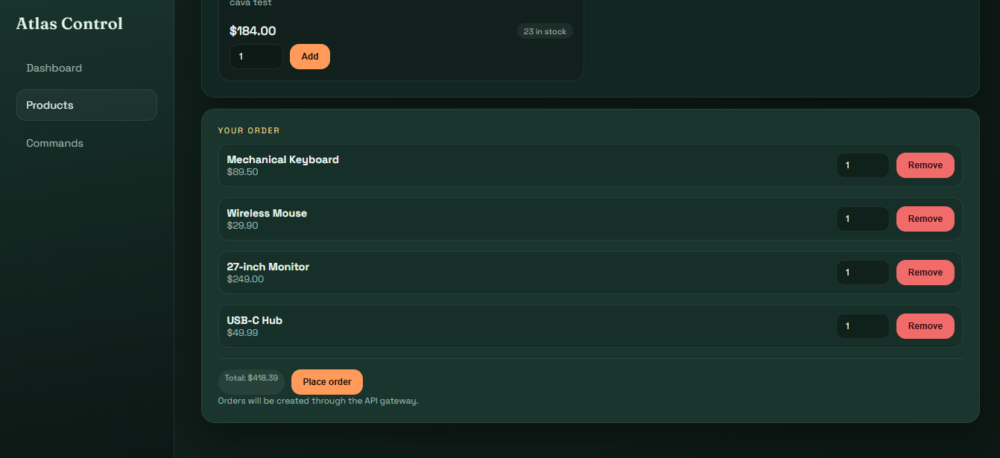

Client: historique des commandes precedentes.

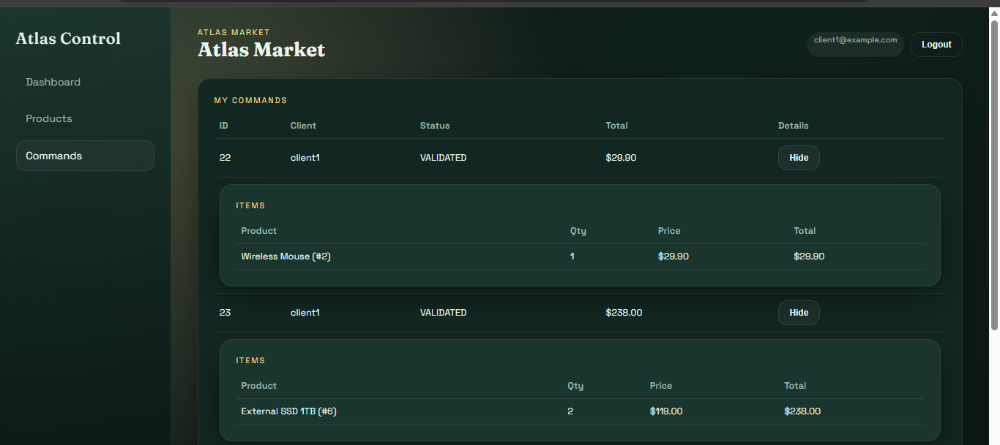

## Conteneurisation

Fichiers fournis:
- `compose.yaml` pour lancer toute la plateforme.
- `produit/Dockerfile`, `commande/Dockerfile`, `gateway-service/Dockerfile`, `frontend/Dockerfile`.

Extrait du `compose.yaml` (services principaux):
```yaml
services:
  produit-service:
    build:
      context: ./produit
    environment:
      DB_HOST: postgres
  commande-service:
    build:
      context: ./commande
  gateway-service:
    build:
      context: ./gateway-service
  frontend:
    build:
      context: ./frontend
```

Extrait Dockerfile Spring Boot (multi-stage):
```dockerfile
FROM eclipse-temurin:21-jdk AS build
WORKDIR /app
COPY .mvn/ .mvn/
COPY mvnw pom.xml ./
RUN ./mvnw -q -DskipTests dependency:go-offline
COPY src ./src
RUN ./mvnw -q -DskipTests package
```

Extrait Dockerfile Frontend:
```dockerfile
FROM node:20-alpine AS build
WORKDIR /app
COPY package.json package-lock.json ./
RUN npm ci
COPY . .
RUN npm run build
```

## Analyse statique du code (ex. SonarQube)

SonarQube est ajoute via Docker Compose et un `sonar-project.properties` a la racine.
Les scans sont lances manuellement pour generer les rapports d'analyse.

Etapes d'execution:
```powershell
docker compose up -d sonar-db sonarqube

mvn -f produit/pom.xml -DskipTests package
mvn -f commande/pom.xml -DskipTests package
mvn -f gateway-service/pom.xml -DskipTests package

docker run --rm -v ${PWD}:/usr/src `
  -e SONAR_HOST_URL=http://host.docker.internal:9000 `
  -e SONAR_TOKEN=REPLACE_KEY `
  sonarsource/sonar-scanner-cli

http://localhost:9000
```

Capture du dashboard SonarQube:

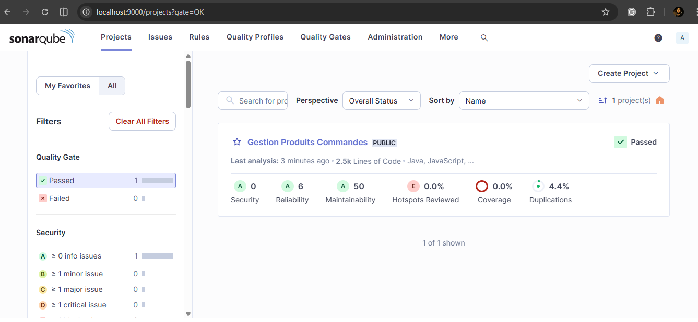
